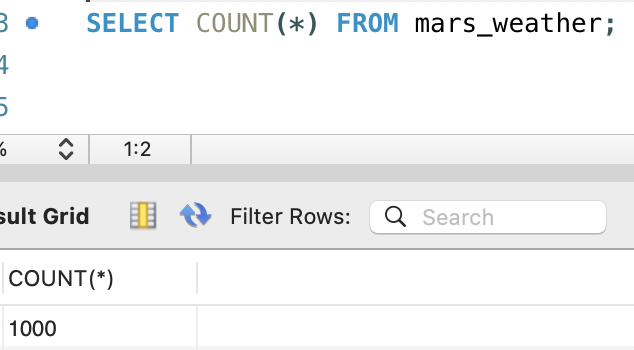
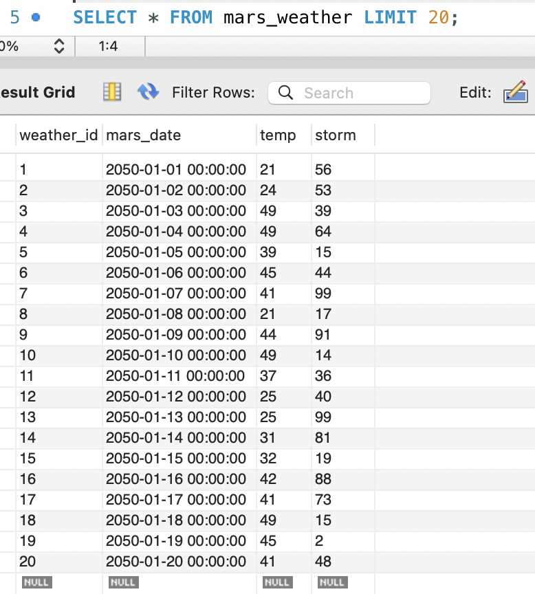

# Week12 Mars Weather MySQL

## 1. 과제 개요
이번 과제에서는 화성 날씨 CSV 데이터를 읽어서 MySQL 데이터베이스의 `mars_weather` 테이블에 저장하는 프로그램을 구현했습니다.

구현 파일은 `mars_weather_summary.py`이며, 다음 흐름으로 동작합니다.

1. MySQL에 연결
2. `mars_weather` 테이블 생성 확인
3. CSV 파일 읽기
4. 반복 `INSERT`로 데이터 저장
5. 저장 결과 확인

## 2. 사용한 기술
- Python 3
- MySQL
- MySQL Workbench
- `mysql-connector-python`
- Python 표준 라이브러리
  - `csv`
  - `sys`
  - `datetime`
  - `pathlib`

## 3. 테이블 구조
저장 대상 테이블 이름은 `mars_weather`입니다.

| 컬럼명 | 타입 | 설명 |
| --- | --- | --- |
| `weather_id` | `INT` | 기본 키, 자동 증가 |
| `mars_date` | `DATETIME` | 화성 날짜 |
| `temp` | `INT` | 온도 |
| `storm` | `INT` | 모래 폭풍 수치 |

## 4. 구현한 코드 설명

### 4-1. DB 연결 설정
스크립트 상단의 `DB_CONFIG` 딕셔너리를 사용해 MySQL 접속 정보를 관리했습니다.

```python
DB_CONFIG = {
    'host': '127.0.0.1',
    'port': 3306,
    'user': 'hawa',
    'password': '663567',
    'database': 'hawa',
}
```

이 설정을 `MySQLHelper` 클래스에 전달해서 데이터베이스 연결을 수행했습니다.

### 4-2. `MySQLHelper` 클래스
보너스 과제로 `MySQLHelper` 클래스를 만들었습니다.

이 클래스는 다음 기능을 담당합니다.
- `connect()`: MySQL 연결
- `execute()`: SQL 실행
- `fetch_all()`: 조회 결과 반환
- `commit()`: 최종 반영
- `close()`: 연결 종료

즉, 데이터베이스 처리 코드를 한 곳에 모아서 재사용하기 쉽게 구성했습니다.

### 4-3. 테이블 생성
`CREATE TABLE IF NOT EXISTS` 구문을 사용해 `mars_weather` 테이블이 없으면 자동으로 생성되도록 했습니다.

```sql
CREATE TABLE IF NOT EXISTS mars_weather (
    weather_id INT PRIMARY KEY AUTO_INCREMENT,
    mars_date DATETIME NOT NULL,
    temp INT,
    storm INT
)
```

### 4-4. CSV 파일 읽기
CSV 파일은 `csv.DictReader()`를 사용해서 읽었습니다.

이 방식을 사용하면 각 행을 딕셔너리 형태로 다룰 수 있어서 아래처럼 컬럼 이름으로 접근할 수 있습니다.

```python
row['mars_date']
row['temp']
row['stom']
```


### 4-5. 데이터 변환
CSV 원본 데이터와 테이블 구조가 완전히 같지 않기 때문에 `convert_row()` 함수에서 값을 변환했습니다.

- `mars_date`: 문자열을 `datetime`으로 변환 후 `YYYY-MM-DD 00:00:00` 형식으로 저장
- `temp`: CSV에 소수로 들어 있으므로 `int(float(...))`로 정수 변환
- `stom`: CSV 헤더의 오타 컬럼명을 `storm` 값으로 사용
- `weather_id`: CSV 구조 검사용으로만 확인하고 `INSERT`에는 사용하지 않음

### 4-6. 반복 INSERT
과제 조건에 맞게 `executemany()`가 아니라 `for` 반복문으로 한 행씩 `INSERT`를 실행했습니다.

```python
for row in rows:
    converted_row = convert_row(row)
    helper.execute(INSERT_WEATHER_QUERY, converted_row)
```

이 과정에서 진행 상황이 보이도록 처음 5건과 100건 단위 진행 메시지를 출력했습니다.

### 4-7. Commit 및 결과 확인
모든 `INSERT`가 끝난 뒤 `commit()`을 호출해서 실제 데이터베이스에 반영했습니다.

그리고 마지막에 아래 내용을 다시 조회해서 결과를 확인했습니다.
- 전체 저장 건수
- 상위 5개 데이터

## 5. 실행 결과

### 전체 행 개수 확인
아래 이미지는 `mars_weather` 테이블에 데이터가 정상 저장되었는지 `COUNT(*)`로 확인한 결과입니다.



### 저장 데이터 조회 결과
아래 이미지는 저장된 데이터 일부를 조회한 결과입니다.



## 6. 구현된 주요 기능 정리
- MySQL 데이터베이스 연결
- `mars_weather` 테이블 자동 생성
- CSV 파일 읽기
- 상위 5개 데이터 미리보기 출력
- 데이터 형식 변환
- 반복 `INSERT` 실행
- `commit()`으로 저장 반영
- 저장 건수 및 샘플 데이터 확인
- `MySQLHelper` 클래스로 DB 기능 분리


